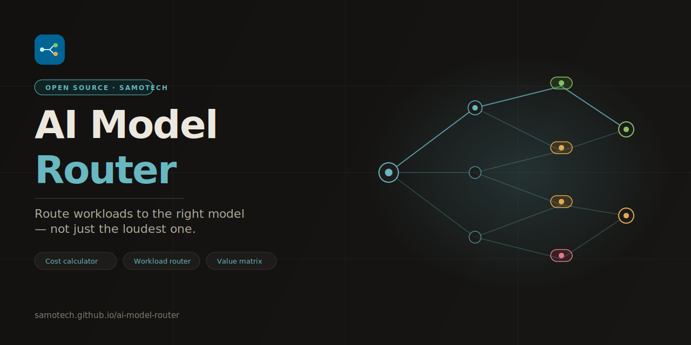

<div align="center">



<br /><br />

[](https://samotech.github.io/ai-model-router/)
[](LICENSE)
[](https://samotech.github.io/ai-model-router/)
[](https://github.com/SamoTech/ai-model-router/actions)
[](CONTRIBUTING.md)
[](https://github.com/SamoTech/ai-model-router/commits/main)

<br />

> Compare 21 models across OpenAI, Anthropic, Google, Mistral, Cohere, xAI, Meta and open-weight providers.<br />
> Interactive cost calculator · Shareable URL state · No build step · Zero backend.

[**→ Open the dashboard**](https://samotech.github.io/ai-model-router/)

</div>

---

## Why this exists

Every week a new frontier model drops claiming to be the best. In practice:

- **GPT-4.1 / 4.1 Mini / 4.1 Nano** are the new OpenAI workhorse tier — from $2 down to $0.10 input per 1M, covering everything from agent coding to bulk classification
- **o4-mini** delivers near-o3 reasoning at $1.10/$4.40 per 1M — the best reasoning-to-cost ratio in the OpenAI lineup
- **Claude Sonnet 4.5** sits between Haiku 4 and Opus 4.6 at $3/$15 — the pragmatic Anthropic default for most coding and writing work
- **Gemini 2.5 Pro** matches or beats Claude Sonnet on coding at $1.25/$10 with a 1M context window
- **Gemini 2.5 Flash** at $0.15/$0.60 is the new speed-value sweet spot for medium-complexity workloads
- **Gemini 3.1 Flash-Lite** dropped to $0.10/$0.40 — the best-kept secret for bulk production traffic
- **Open models** (Llama 4 Maverick, DeepSeek, Qwen) win when you have infra, privacy requirements, or fine-tuning needs

This dashboard makes those tradeoffs explicit with a workload router, a live cost calculator, and a value matrix pulled from a single JSON file.

---

## Models covered (April 2026)

| Provider | Models |
|---|---|
| **OpenAI** | GPT-5.4, GPT-4.1, GPT-4.1 Mini, GPT-4.1 Nano, o3, o4-mini |
| **Anthropic** | Claude Opus 4.6, Claude Sonnet 4.5, Claude Haiku 4 |
| **Google** | Gemini 2.5 Pro, Gemini 2.5 Flash, Gemini 3.1 Flash-Lite, Gemini Flash Live |
| **Mistral** | Mistral Medium 3, Mistral Small 3.1 |
| **Cohere** | Command A, Command R+ |
| **xAI** | Grok 3 |
| **Meta / open** | Llama 4 Maverick |
| **Open / self-host** | DeepSeek reasoning class, Qwen coding class |

---

## Features

| Feature | Detail |
|---|---|
| 🗺️ Workload router | Maps coding / long-context / voice / computer-use / bulk traffic to winner + runner-up |
| 💰 Cost calculator | Monthly spend per model; long-context surcharge logic built in |
| 🔗 Shareable state | Calculator inputs sync to URL hash — bookmark or share any scenario |
| 📊 Radar scorecard | 5-dimension routing heuristic chart per model |
| 🏷️ Value matrix | Per-model verdict badge (overpriced / worth it selectively / best deal) with live provider + verdict filters |
| 🌗 Light + dark mode | Follows system preference with manual toggle |
| 📦 Data-driven | All model data in `data/models.json` — update prices without touching the UI |
| ⚡ Zero build step | Pure static HTML + JSON; works on any CDN or file server |

---

## `data/models.json` schema

Top-level shape:

```jsonc
{
  "updated": "YYYY-MM-DD",   // shown in the dashboard Data status panel
  "models": [ /* ModelEntry[] */ ]
}
```

### ModelEntry fields

| Field | Type | Required | Description |
|---|---|---|---|
| `id` | string | ✅ | Unique kebab-case slug, e.g. `gemini-2-5-flash` |
| `name` | string | ✅ | Display name shown in all UI |
| `provider` | string | ✅ | `OpenAI` \| `Anthropic` \| `Google` \| `Mistral` \| `Cohere` \| `xAI` \| `Meta / hosted vendors` \| `Open / self-host` |
| `inputRate` | number\|null | ✅ | USD per 1M input tokens; `null` for self-hosted |
| `outputRate` | number\|null | ✅ | USD per 1M output tokens; `null` for self-hosted |
| `contextWindow` | string | ✅ | Human-readable context size, e.g. `1M tokens` |
| `color` | string | ✅ | Unique 6-digit hex `#rrggbb` — used in radar + bar charts |
| `bestAt` | string | ✅ | One-line routing hint |
| `verdict` | string | ✅ | `good` \| `warn` \| `bad` |
| `verdictLabel` | string | ✅ | 2–4 word badge label |
| `take` | string | ✅ | 1–2 sentence opinionated routing note |
| `benchmarks` | object | — | Any key → string value, e.g. `{ "MMLU": "85.1%" }` |
| `radar` | object | ✅ | All five keys required — see below |
| `longContextInputRate` | number | — | Surcharge input rate above threshold |
| `longContextThreshold` | number | — | Token count where surcharge activates |
| `audioInputRate` | number | — | Voice models only — USD per 1M audio input tokens |
| `audioOutputRate` | number | — | Voice models only — USD per 1M audio output tokens |
| `perMinute` | number | — | Voice cost per minute |

### `radar` object

All five keys are required. Integer 0–10. CI rejects values outside this range.

| Key | What it measures |
|---|---|
| `coding` | SWE-Bench score / agentic code quality |
| `longContext` | Context window size + long-range retrieval quality |
| `voice` | Native realtime audio capability |
| `computerUse` | OSWorld / GUI automation score |
| `costEfficiency` | Price per 1M tokens relative to quality delivered |

### Adding a new model

See **[docs/adding-a-model.md](docs/adding-a-model.md)** for the full step-by-step guide.

The short version:
1. Copy an existing entry in `data/models.json`
2. Fill in all required fields; use `null` for unknown pricing
3. Pick a unique `color` hex not already used in the file
4. Set all five `radar` scores (0–10)
5. Update the top-level `"updated"` date
6. Commit to `main` — CI validates and redeploys automatically

---

## Repository structure

```
ai-model-router/
├── index.html                   # Dashboard UI — fetches data/models.json at runtime
├── assets/
│   ├── logo.svg                 # 48×48 brand mark
│   ├── favicon.svg              # 32×32 browser tab icon
│   └── banner.svg               # 1280×640 GitHub social preview
├── data/
│   └── models.json              # ✏️  Source of truth — edit this to update the dashboard
├── docs/
│   ├── adding-a-model.md        # Step-by-step guide for new model entries
│   └── ci.md                    # CI pipeline documentation
├── .github/
│   └── workflows/
│       └── pages.yml            # JSON schema validation + HTML lint + Pages deploy + health-check
├── .htmlhintrc                  # HTML lint rules for CI
├── .nojekyll                    # Disables Jekyll so the site is served as-is
├── CHANGELOG.md                 # Keep a Changelog format
├── CONTRIBUTING.md              # Contributor guide
├── RESEARCH.md                  # Pricing sources and model audit log
├── SECURITY.md
└── README.md
```

---

## Local preview

```bash
# Option 1
npx serve .

# Option 2
python -m http.server 8080
```

Open `http://localhost:8080`.

> ⚠️ Do **not** open `index.html` as a `file://` URL — the `fetch('./data/models.json')` call will be blocked by browser CORS policy on local file URLs.

---

## Tech stack

| Layer | Choice |
|---|---|
| UI | Vanilla HTML + CSS custom properties |
| Charts | [Chart.js 4.4](https://www.chartjs.org/) via CDN |
| Icons | [Lucide 0.469.0](https://lucide.dev/) via jsDelivr |
| Fonts | Cabinet Grotesk + Satoshi via [Fontshare](https://www.fontshare.com/) |
| Data | `data/models.json` — static, fetched at runtime |
| Hosting | [GitHub Pages](https://pages.github.com/) |
| CI | [GitHub Actions](https://github.com/features/actions) |

---

## Changelog

See [CHANGELOG.md](CHANGELOG.md) for the full history.

### Recent — April 2026
- **CI:** Added `health-check` job (verifies live site returns HTTP 200 after every deploy)
- **CI:** Added HTML lint step via `htmlhint` + `.htmlhintrc` config
- **Docs:** Added `RESEARCH.md` with pricing sources and 21-model audit
- **Docs:** Added `docs/ci.md` and `docs/adding-a-model.md`
- **Data:** Expanded to 21 models across 9 providers
- **UI:** Filter bar with provider + verdict chips; empty state; shareable URL hash
- **Perf:** 300ms input debounce, chart instance reuse, pinned CDN versions

---

## Contributing

See [CONTRIBUTING.md](CONTRIBUTING.md). The fastest contribution is editing a price or verdict directly in `data/models.json` on GitHub and committing — no local setup needed.

## Security

See [SECURITY.md](SECURITY.md). This project has no backend or user data. Responsible disclosure goes to a GitHub Security Advisory (private).

## License

[MIT](LICENSE) © 2026 [SamoTech](https://github.com/SamoTech)
